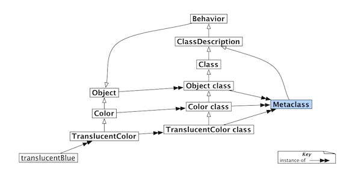

!SLIDE subsection

# The Object Model #

!SLIDE code center
    @@@ ruby
    cat = "lol"
    dog = "grr"

!SLIDE code
    @@@ ruby
    def cat.meme?()
      true
    end

!SLIDE code
    @@@ ruby
    cat.meme?()

    => true

!SLIDE code center
    @@@ ruby
    dog.meme?()

    NoMethodError

!SLIDE bullets incremental
# How does this work? #

* This works through invisible classes
* These objects are called singleton class
* Mostly invisible in the language

!SLIDE code
    @@@ ruby
    klass = class << cat; self; end

    klass.instance_methods.include?(:meme?)

    => true

!SLIDE code
    @@@ ruby
    klass = class << cat; self; end

    klass.instance_methods.include?(:meme?)

    => true

    cat.class()

    => String

!SLIDE code
    @@@ ruby
    klass = class << cat; self; end

    klass.instance_methods.include?(:meme?)

    => true

    cat.class()

    => String

    cat.is_a?(klass)

    => true

!SLIDE bullets incremental
# Singleton Classes #
* Every object has exactly one
* Every singleton class is associated to exactly one object
* It sits between the object and its class
* allows to attach functionality to a single object
* Are generated lazily

!SLIDE bullets incremental
# Singleton Classes (2) #
* If classes are Objects
* And classes are instances of object
* how are class methods defined?

!SLIDE
# Example #
    @@@ ruby
    class Cat
      def self.miaow()
        "miaow"
      end
    end

!SLIDE
# Example (2) #
    @@@ ruby
    class Cat
      def Cat.miaow()
        "miaow"
      end
    end

!SLIDE bullets incremental
# Singleton Classes (3)
* classes also have singleton classes
* classes are instances of the class Class
* class methods are defined on the singleton class of the class
* but what about the singleton classes of singleton classes?

!SLIDE center
#Smalltalk Object Model

